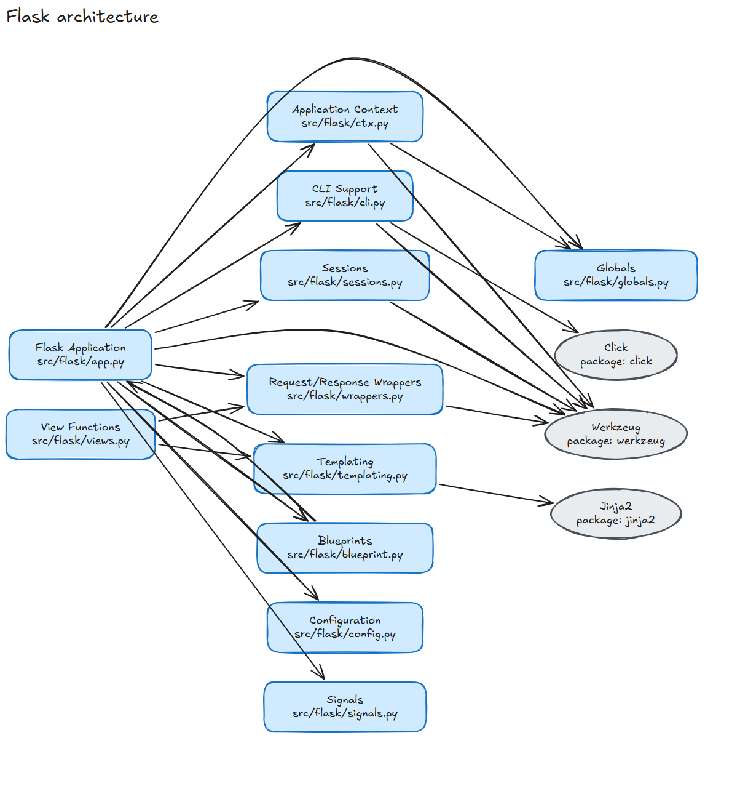
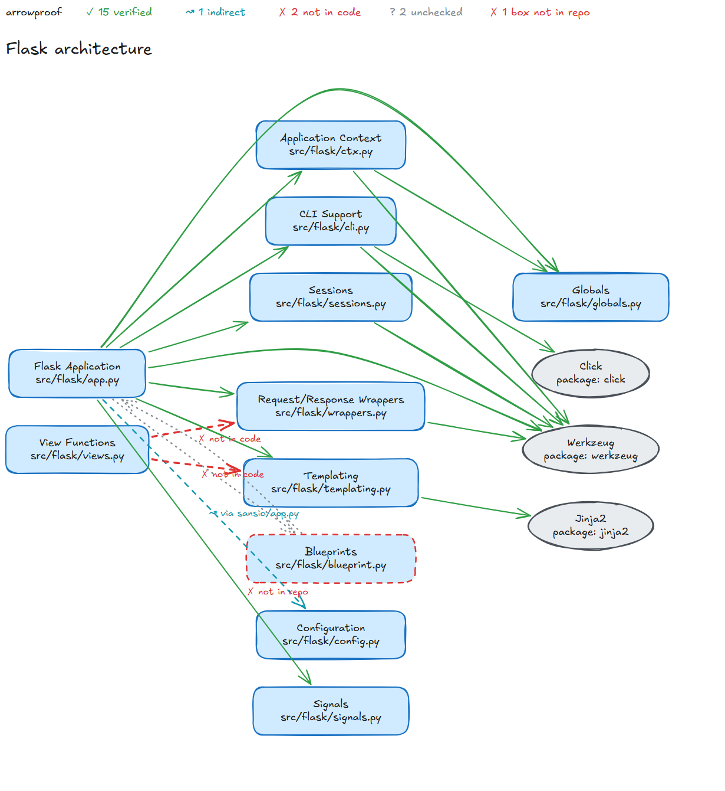
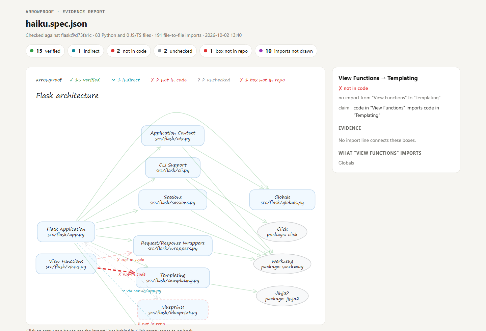
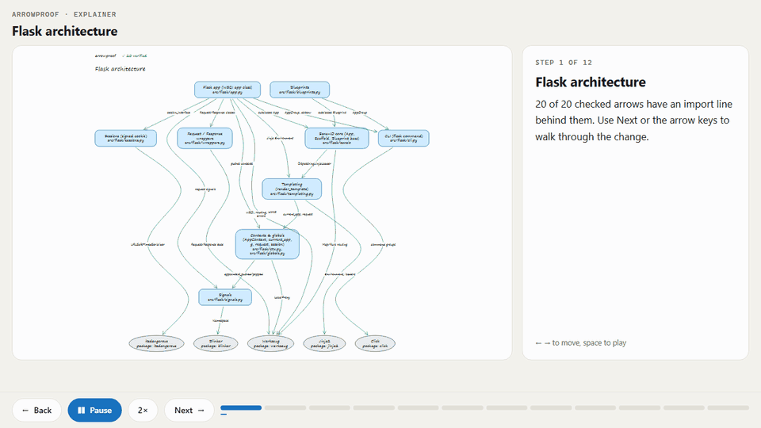

# arrowproof

**Every arrow in your architecture diagram, checked against the code.**

[Karpathy's advice](https://x.com/karpathy/status/2105819303471976479) is to ask your LLM for a diagram instead of a wall of text. The advice is good, with one catch: a diagram that a model draws looks right even when it is wrong. arrowproof is an agent skill that checks every box and every arrow of an Excalidraw diagram against the real import graph of your repository. It shows you the import line behind each arrow.

<table>
<tr>
<th width="50%">Claude Haiku drew Flask from memory</th>
<th width="50%">After arrowproof</th>
</tr>
<tr>
<td></td>
<td></td>
</tr>
</table>

The result: 15 arrows verified. 1 arrow is indirect, because `app.py` reaches `config.py` only through `sansio/app.py`. 2 arrows have no import behind them, because `views.py` imports only `globals.py` and the type aliases in `typing.py`. 1 box points to `blueprint.py`, a file that does not exist (the real file is `blueprints.py`). Claude Opus drew the same architecture with 20 arrows, and all 20 passed. Both runs are in [`examples/flask`](examples/flask).

**Try it live, with nothing to install:**

- [The Flask architecture as a step-by-step explainer](https://ahmtsahin.github.io/arrowproof/examples/flask/opus.explainer.html#play=1), with the import lines behind every arrow.
- [The evidence report for the Haiku diagram](https://ahmtsahin.github.io/arrowproof/examples/flask/haiku.report.html). Click an arrow to see why it passed or failed.
- [The checked Haiku diagram in Excalidraw](https://excalidraw.com/#url=https://raw.githubusercontent.com/ahmtsahin/arrowproof/main/examples/flask/haiku.verified.excalidraw), ready to edit.

## What it does

- **Checks every arrow.** `A → B` claims that code in box A imports code in box B. The result is ✓ verified, ↝ indirect (through one other file), ⇄ reversed, or ✗ not in code.
- **Checks every box.** The path must exist. A package must be imported somewhere.
- **Finds what the diagram leaves out.** It lists the imports between two boxes that have no arrow.
- **Shows the receipts.** The HTML report shows the file, the line and the import statement behind each arrow. Click an arrow to see them.
- **Draws new diagrams.** It lays out a short spec as an editable `.excalidraw` file, then checks it.
- **Explains a change, step by step.** An interactive page walks through the checked diagram. Each step zooms to its boxes and shows the import lines behind its arrows. Arrows without evidence stay marked, so the story cannot claim more than the code shows.
- **Runs in CI.** The exit code is 1 when a diagram in your docs no longer matches the code.

It reads Python and JavaScript/TypeScript: `tsconfig` paths, workspace packages, `require` and `import()`. It uses the Python standard library only. There is nothing to install.

<a href="https://ahmtsahin.github.io/arrowproof/examples/flask/haiku.report.html"></a>

## Install

For any agent that reads [Agent Skills](https://agentskills.io) (Claude Code, Codex, Cursor, Gemini CLI, OpenCode and others):

```bash
npx skills add ahmtsahin/arrowproof
```

As a Claude Code plugin:

```bash
claude plugin marketplace add ahmtsahin/arrowproof
claude plugin install arrowproof@arrowproof
```

Then ask your agent:

- "Draw the architecture of this repo."
- "Check docs/architecture.excalidraw against the code."
- "Is this diagram still correct?"

## Use it without an agent

```bash
python skills/arrowproof/scripts/graph.py .
```

```bash
python skills/arrowproof/scripts/verify.py docs/architecture.excalidraw --repo .
```

`graph.py` prints the real import graph, grouped by file or folder. `verify.py` accepts an `.excalidraw` file or a spec, and writes `<name>.verified.excalidraw` and `<name>.report.html`. The original file does not change.

A spec is a short JSON file:

```json
{"title": "Checkout service",
 "nodes": [{"id": "web", "label": "Browser"},
           {"id": "api", "label": "HTTP API", "paths": ["src/api"]},
           {"id": "orders", "label": "Orders", "paths": ["src/orders"]},
           {"id": "pg", "label": "Postgres", "packages": ["pg"]}],
 "edges": [{"from": "web", "to": "api", "kind": "flow"},
           {"from": "api", "to": "orders"},
           {"from": "orders", "to": "pg", "label": "queries"}]}
```

## Explain a change, step by step

Karpathy's next step after the diagram is an interactive page. `explain.py` turns a checked diagram into one: the diagram on the left, a guided tour on the right, and the code behind every arrow.



```bash
python skills/arrowproof/scripts/explain.py architecture.spec.json --repo .
```

Add a `tour` to the spec to tell the story in your own words, step by step. Without one, the tour is built from the verified arrows alone, with at most 4 arrows on a step. Either way, the page ends with what the code does not support and what the diagram leaves out. Each step plays for 6 to 14 seconds, by the length of its text, and a button switches between 1×, 1.5× and 2×. A link can open a step, a speed and autoplay: `#step=3&speed=2&play=1`.

Try it live: [Flask, drawn by Claude Opus](https://ahmtsahin.github.io/arrowproof/examples/flask/opus.explainer.html#play=1) and [arrowproof's own architecture](https://ahmtsahin.github.io/arrowproof/examples/self/arrowproof.explainer.html#play=1).

## Keep the diagrams in your docs honest

```yaml
- uses: actions/checkout@v4
- run: git clone --depth 1 https://github.com/ahmtsahin/arrowproof /tmp/arrowproof
- run: python /tmp/arrowproof/skills/arrowproof/scripts/verify.py docs/architecture.excalidraw --repo . --no-report
```

This repository does the same for its own diagram, [`examples/self`](examples/self/arrowproof.spec.json), on every push.

## How a diagram maps to code

A box maps to code through `customData.arrowproof` on the Excalidraw element: `{"paths": ["src/api"]}` or `{"packages": ["stripe"]}`. A diagram from arrowproof already carries this data. A diagram that someone drew by hand is mapped by its labels: a path in the label, or the name of a file, a folder or a package. The report tells you which boxes were mapped by label, so that you can correct a wrong match.

An arrow can carry a kind. `uses` is the default and is checked in the direction of the arrow. `flow` is a data or request flow, for example an HTTP call or a child process. An import in either direction confirms a flow. Without one, the flow stays unchecked, because a run-time flow is not visible in the imports. `skip` is a conceptual arrow and is not checked. An arrow from a package to your code is checked in either direction, because a package cannot import your code.

A package box counts as present when a file imports the package or when `package.json`, `requirements*.txt` or `pyproject.toml` declares it. A box whose files are in a language that arrowproof does not read leaves its arrows unchecked instead of marking them wrong.

## Limits

- The check reads imports only. HTTP calls, queues, dependency injection and imports with computed names are not visible. A ✗ is a claim without evidence, not proof of a bug.
- An import under `TYPE_CHECKING` or `import type` supports an arrow but is marked as type-only. It does not count for indirect paths or for missing arrows.
- Only Python and JavaScript/TypeScript are read. Hidden folders such as `.tmp` or `.runtime` are skipped, except `.github`, `.claude`, `.claude-plugin`, `.codex`, `.agents` and `.storybook`, and any hidden folder that a box names.
- The SVG preview approximates the Excalidraw look. Open the `.excalidraw` file in excalidraw.com, VS Code or Obsidian for the real one.

## Development

```bash
python -m unittest discover -s tests
```

`tools/render-check.html` opens a file with the official Excalidraw library, to confirm that it loads and to make the images in `docs/`. Serve the repository root (for example `python -m http.server 8765`) and open `tools/render-check.html?file=../examples/flask/haiku.verified.excalidraw`.

`tools/record_gif.py` records an explainer page as the GIF in `docs/`. It needs Google Chrome and Pillow:

```bash
python tools/record_gif.py "http://localhost:8765/examples/flask/opus.explainer.html#play=1&speed=2" docs/explainer.gif
```

## License

MIT
